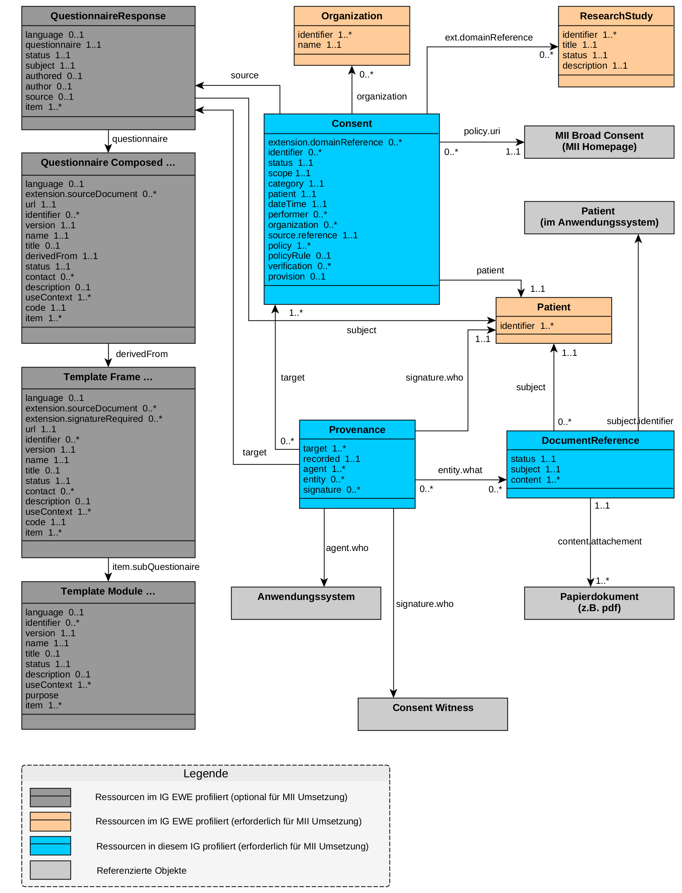

# UML-Diagramme - MII Implementation Guide Consent v2026.0.0

* [**Inhaltsverzeichnis**](toc.md)
* [**Anleitung**](guidance.md)
* **UML-Diagramme**

## UML-Diagramme

 Diese Seite enthält Übersetzungen aus der Originalsprache, in der der Leitfaden verfasst wurde. Informationen zu diesen Übersetzungen und Anweisungen zum Abgeben von Feedback zu den Übersetzungen finden Sie [hier](translationinfo.md). 

### UML-Diagramme

#### Consent

Die Consent-Resource stellt eine rein maschinenlesbare Repräsentation der real existierenden Einwilligung einer Person dar und wird für das Enforcement (Durchsetzung, Umsetzung) der Consent-Policies verwendet.

Die Einwilligung wird in einem konkreten Kontext (z. B. MII) erhoben, was in FHIR in Form einer Referenz auf die verantwortliche Organisation ([Organization](https://ig.fhir.de/einwilligungsmanagement/stable/Organization.html)) und/oder zu einem Forschungsprojekt ([ResearchStudy](https://ig.fhir.de/einwilligungsmanagement/stable/ResearchStudy.html)) modelliert wird.

#### Provenance

Die Provenance-Resource beschreibt die Herkunft der Einwilligungsinhalte (u. a. Unterschriften) und verknüpft diese mit den beteiligten Personen ([Patient](https://ig.fhir.de/einwilligungsmanagement/stable/Patient.html), Consent Witness) und eventuell vorhandenen Dokumenten-Scans ([DocumentReference](StructureDefinition-56375452-bfa1-4111-af7c-5b5ba9a1857c.md)). Ebenso können die für die Erhebung genutzten Anwendungssysteme genannt (display) bzw. referenziert werden, sowie im Anwendungssystem geltende Patienten-Identifier.

#### Abbildung von Fragebögen

Der Einsatz **aller** in der AG Einwilligungsmanagement entwickelten Profile ist **nicht verpflichtend**. Für die Abbildung der Questionnaire-basierten Inhalte (siehe [Fragebögen](implementer-guidance.md)) sind die Empfehlungen der TFCU zu berücksichtigen.

#### Relevante Profile

Hinweise zum UML-Klassendiagramm des Erweiterungsmoduls Consent:

* **Blau** eingefärbte Klassen werden bei der Abbildung und Profilierung in FHIR berücksichtigt, sind in diesem IG profiliert und bei der MII-Umsetzung erforderlich.
* **Orange** eingefärbte Klassen sind im IG der AG Einwilligungsmanagement profiliert und erforderlich für die MII-Umsetzung.
* **Grau** eingefärbte Klassen sind im IG der AG Einwilligungsmanagement profiliert und optional für die MII-Umsetzung.
* **Hellgrau** eingefärbte Klassen werden referenziert. Diese werden jedoch nicht bei der Abbildung und Profilierung in FHIR berücksichtigt.

Die in den Klassen des Diagramms hinterlegten Attribute sind verpflichtend. Darüber hinaus können weitere optionale Attribute angegeben werden.

