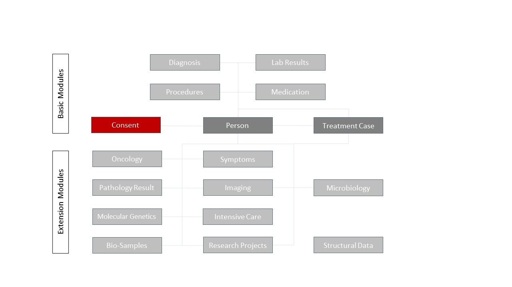

# Home - MII Implementation Guide Consent v2026.0.0

* [**Table of Contents**](toc.md)
* **Home**

## Home

| | |
| :--- | :--- |
| *Official URL*:https://www.medizininformatik-initiative.de/fhir/modul-consent/ImplementationGuide/mii-ig-consent | *Version*:2026.0.0 |
| Draft as of 2026-08-06 | *Computable Name*:MII_IG_Consent |

##### TODO:REVIEW (Gate C) — unreviewed machine translation

The authoritative text of this module is **German**. This English page is an **unreviewed machine translation** of `input/translations/de/pagecontent/index.md`, which was migrated from the Simplifier-rendered guide (`simplifier.net/guide/miiigmodulconsent`, version 2026.0.0, harvested 2026-08-06). Consent policy wording, policy display names and the names of the MII Broad Consent form modules are **deliberately left in German**: they are legally binding text and identifiers, not prose. Where the two language variants differ, the German page (language switcher, top right) applies.

### Introduction

This specification describes the FHIR representation of the Core Dataset (CDS) module **Consent** of the Medical Informatics Initiative (MII). It describes the module's use cases and the associated FHIR profiles and terminology resources in their normative form.

| | |
| :--- | :--- |
| Date | 2025-12-18 |
| Version | 2026.0.0 (CalVer`YYYY.n.n`) |
| Status | active |
| Realm | DE |

> **TODO:REVIEW (Gate A):** date and status are taken from the publication table of the migrated Simplifier guide (18.12.2025, `active`). This repository's `sushi-config.yaml` carries `date: 2026-08-06` (the migration date) and `status: draft` (from the published ImplementationGuide resource). The divergence was **not** silently normalised — it is a human decision.

### Description of the Consent module

The MII CDS module Consent is a base module of the Core Dataset (CDS) of the Medical Informatics Initiative (MII). It builds on the [published preliminary work of the MII Taskforce Consent Umsetzung](https://bmcmedinformdecismak.biomedcentral.com/articles/10.1186/s12911-020-01138-6).

For representing the [MII Broad Consent](https://www.medizininformatik-initiative.de/de/mustertext-zur-patienteneinwilligung), the module follows the **[FHIR R4 profiles](https://ig.fhir.de/einwilligungsmanagement/stable) of the [AG Einwilligungsmanagement](https://wiki.hl7.de/index.php?title=Einwilligungsmanagement_(Projekt)) of the [Interop-Forum](https://wiki.hl7.de/index.php?title=Hauptseite)** for form data (Questionnaire, QuestionnaireResponse) and consents (Consent).

The module's focus is the operationalisation (enforcement) of the consent filled in by the patient, on the basis of the consent policies (consolidated with the MII AG Consent in December 2021).

### Target audience

##### Implementers

Data Integration Centers (DIC), software developers and system architects building FHIR-based solutions.
 → see [Profiles and Extensions](profiles-and-extensions.md) and [Guidance for Implementers](implementer-guidance.md).

##### Researchers

Scientists using MII data for medical research.
 → see [Guidance for Researchers](researcher-guidance.md).

### Contents

* **[Guidance](guidance.md)** — getting started and domain notes.
* **[Conformance](conformance.md)** — normative requirements, Must-Support and handling missing data.
* **[Profiles and Extensions](profiles-and-extensions.md)** and **[Terminology](terminology.md)** — the technical artifacts.
* **[Search Parameters and Operations](search-parameters-and-operations.md)** — the module's own search parameters.
* **[Examples](examples.md)** — example instances.

### Related guides

* [Implementation Guide of the AG Einwilligungsmanagement of the Interop-Forum](https://ig.fhir.de/einwilligungsmanagement/stable/) — this module's formal dependency (`de.einwilligungsmanagement` in `sushi-config.yaml`).
* [Core Dataset description in ART-DECOR](https://art-decor.org/art-decor/decor-datasets--mide-?conceptId=2.16.840.1.113883.3.1937.777.24.2.184) — the domain dataset description of this module.
* [MII Broad Consent (model patient consent form)](https://www.medizininformatik-initiative.de/de/mustertext-zur-patienteneinwilligung).

How the module fits into the overall project and how it relates to other modules is described on [Guidance for Implementers](implementer-guidance.md); the full reference list is in its **References** section.

More FHIR implementation guides can be found in the official **[FHIR IG Registry](https://fhir.org/guides/registry/)** (source: [`FHIR/ig-registry`](https://github.com/FHIR/ig-registry)).

### Imprint

This guide was created within the Medical Informatics Initiative and is subject, by its governance process, to the coordination procedure of the Interoperability Forum and the technical committees of HL7 Germany.

### Authors and contacts

The **MII Taskforce Consent Umsetzung** is responsible for the content of the module presented here.

The Consent module was created with contributions from Martin Bialke, Sebastian Stäubert, Angela Merzweiler, Lars Geidel, Jörg Römhild, Raffael Bild, Fabian Prasser and Stefan Lang (HL7 Germany, technical committee FHIR, Gefyra GmbH, Lang Health IT Consulting).

Module leads:

* Sebastian Stäubert
* Martin Bialke

Technical implementation:

* Stefan Lang (technical implementation of the FHIR profiles and implementation guides)
* Martin Bialke (support for the implementation guides)

Contact at the TMF:

* Karoline Buckow

Comments can be raised as an issue on GitHub (free registration required) or sent informally by e-mail to [office@medizininformatik-initiative.de](mailto:office@medizininformatik-initiative.de).

* GitHub (original module): [medizininformatik-initiative/kerndatensatzmodul-consent/issues](https://github.com/medizininformatik-initiative/kerndatensatzmodul-consent/issues)

For questions we are available at [office@medizininformatik-initiative.de](mailto:office@medizininformatik-initiative.de).

### Copyright and License

© 2019+ TMF e. V., Charlottenstraße 42, 10117 Berlin

This work is licensed under the [Creative Commons Attribution 4.0 International License](https://creativecommons.org/licenses/by/4.0/).

For the usage rights of the underlying FHIR technology, see the FHIR base specification.

Some of the code systems used are published and maintained by other organizations; the copyright of the respective publishers applies.

### Disclaimer

The content of this document is public. Please note that parts of this document are based on FHIR version R4, which is copyrighted by HL7 International.

Although this publication was prepared with the greatest care, the authors cannot accept any liability for direct or indirect damage that may arise from the content of this specification.

