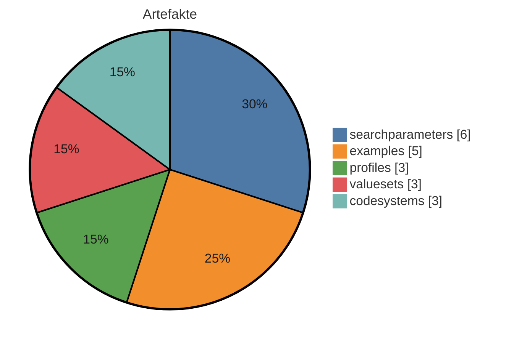

# IG-Statistik — migrated

_Modus: `static` · Stand: 2026-08-06T15:55:05Z · Commit: `4d44dbe`_

## Kennzahlen-Überblick

### Artefakte (Σ 20 publiziert)

_Hier wird gezählt, wie viele FHIR-Bausteine (Profile, Extensions, ValueSets usw.) der IG je Typ definiert._

| Typ | Anzahl |
|---|---|
| searchparameters | 6 |
| examples | 5 |
| profiles | 3 |
| valuesets | 3 |
| codesystems | 3 |

_Interne FSH-Konstrukte (nicht in Σ): 55 rulesets._

## Inhaltsumfang & Repo-Hygiene

_Linguistische Kennzahlen zum Textumfang (Wörter je Seite, Durchschnitt) sowie Hinweise auf inhaltliche Dopplungen und nicht referenzierte Dateien (Dead-Code-Analogie) - hilft, Umfang und Aufräumpotenzial einzuschätzen._

| Kennzahl | Wert |
|---|---|
| Inhalts-Seiten | 22 |
| Wörter gesamt | 11513 |
| Ø Wörter / Seite | 523,3 |
| Median Wörter / Seite | 289 |
| kürzeste / längste Seite | 93 / 2733 Wörter |
| doppelte Inhaltsblöcke | 2 |
| identische Seiten (Gruppen) | 0 |
| Bilder nicht referenziert | 0 von 0 |
| Beispiele nicht in Narrativen | 0 von 5 |

_Heuristik: 'nicht referenziert' = Dateiname/Artefaktname kommt in keiner Erklärseite vor. Kein Beweis für Ungenutztheit (Referenz kann über Konfiguration/Build erfolgen)._

## Reife-Komponenten (gezählt)

_Gezählte Reife-Komponenten nebeneinander: Status, Vollständigkeit der Dokumentation, Beispiel-Abdeckung der Profile und Governance-Merkmale. Bewusst kein verdichteter Score und kein Freigabe-Urteil — die Einordnung bleibt menschlich._

| Komponente | Wert |
|---|---|
| Status | active |
| Doku-Vollständigkeit (Inhalt vs. Stubs) | 100 % |
| Beispiel-Abdeckung Profile | 100 % (3/3) |
| Governance (CI · ig.ini · publication · devcontainer) | 100/100 |

## Strategie: Wiederverwendung, Lock-in & Zukunftssicherheit

_Strategische Kennzahlen: Bindung an die Quellplattform (Lock-in), Anteil standardisierter Terminologie, Wiederverwendung externer Bausteine und Zukunftssicherheit (FHIR-Version, Pflege-Aktivität)._

| Kennzahl | Wert |
|---|---|
| Hersteller-Lock-in | 0/100 (gering) · 0 Direktiven/Seite |
| Standard-Terminologie-Anteil | 98 % (SNOMED CT, LOINC, ICD-10) |
| Wiederverwendung externer Profile (Parents) | 100 % (3 von 3 Profil-Parents extern; abstrakte LM-Basistypen ausgeschlossen) |
| FHIR-Version | R4 — aktuell verbreitet |
| Dependency-Veraltung | 0 veraltet (Heuristik) |
| Pflege-Kadenz | 24.5 Commits/Jahr · letzter Commit vor 0 Tagen |

_Lock-in und Standard-Terminologie-Anteil sind grobe Heuristiken aus Textvorkommen. Heuristik aus CalVer-Jahr; exakt nur via Package-Registry (extern)._

## Risiko & Compliance

_Entscheidungsrelevante Risiken für die Freigabe: Terminologie-Lizenzen, unterdrückte Warnungen, Datenschutz-Substanz, Wissenskonzentration (Bus-Faktor) und Kompatibilitätsbruch zur Vorversion._

| Risiko | Bewertung |
|---|---|
| Terminologie-Lizenz | Lizenzbedarf möglich — SNOMED CT: lizenzpflichtig (Affiliate/Land), LOINC: frei (Registrierung), ICD-10: frei |
| Unterdrückte QA-Warnungen | 8 (davon 0 breit) → gering |
| Datenschutz-Seite (Substanz) | fehlt/nur Stub (0 Wörter) |
| PII-artige Beispieldaten | keine erkannt |
| Bus-Faktor (Wissenskonzentration) | 32 % Top-Autor → gering |
| Breaking-Change-Risiko ggü. Vorversion | — (nur per Build/Vorversions-Diff) |

## Befunde & Einordnung

_Je Themenbereich der gemessene Befund und eine neutrale Einordnung, was er über den Guide aussagt — keine Handlungs- oder Migrationsanweisungen._

| Bereich | Befund | Einordnung |
|---|---|---|
| Artefakte (FSH) | 20 publiziert, FSH vorhanden | Zählt die publizierten Konformitätsressourcen und ob FSH-Quelltext vorliegt. FSH-Quellen machen den Bestand direkt les-, diff- und weiterverarbeitbar; ohne sie ist nur das generierte JSON/XML die Quelle. |
| Narrative | 22 Inhalts-Seiten, Format target | Anzahl und Format der Erklärseiten (source = Plattformformat, target = IG-Publisher-Format). Das Format bestimmt, welche Werkzeuge die Seiten unverändert verarbeiten können. |
| Direktiven | 0 (0 unbekannt) | Vorkommen plattformspezifischer Platzhalter/Tags, die nur die Quellplattform interpretiert. Je mehr davon, desto stärker ist die Darstellung an die Plattform gebunden (vgl. Lock-in-Kennzahl). |
| Dependencies | 2 (0 floating) | Deklarierte Paket-Abhängigkeiten und ihr Pinning. Floating-Einträge folgen automatisch neuen Versionen und machen Builds weniger reproduzierbar — der Wert zeigt, wie reproduzierbar der aktuelle Stand ist. |
| Mehrsprachigkeit | FSH-Übersetzung ja, Supplements 0 | Ob Übersetzungen in den FSH-Quellen (translation-Extensions) und/oder als Publisher-Supplements vorliegen. Die beiden Mechanismen decken unterschiedliche Textarten ab; der Wert zeigt den vorhandenen Stand, nicht den Bedarf. |
| Pflichtseiten | 11/11 im Zielformat | Wie viele Seiten des hinterlegten Pflicht-Rasters (mandatory_pages in dieser Datei) im Zielformat existieren. Die Aussagekraft hängt vom Raster ab: Nutzt ein Guide legitim ein anderes Seitenraster, wird das Raster korrigiert — nicht die Seiten als fehlend gewertet. |
| QC-Regeln | 12 definiert | Anzahl der im Projekt definierten Qualitätsregeln (qc/custom.rules.yaml). Statisch wird nur die Definition gezählt; Verletzungen zeigt erst der Qualitätslauf eines Builds. |
| Metadaten/Config | id mii-ig-consent, v2026.0.1 | Kern-Identität (id, Version) wie in sushi-config.yaml/package.json deklariert; die vollständigen Identitätsfelder stehen im Anhang. |

# Anhang: Detailaufschlüsselung

_Im Anhang steht jeder Einzelwert mit seiner Quelle, damit man die Kennzahlen nachvollziehen kann, ohne im Projekt suchen zu müssen._

## Identität & Herkunft

| Feld | Wert | Quelle |
|---|---|---|
| id | mii-ig-consent | sushi-config.yaml / package.json |
| canonical | https://www.medizininformatik-initiative.de/fhir/modul-consent | sushi-config.yaml / package.json |
| packageId | de.medizininformatikinitiative.kerndatensatz.consent | sushi-config.yaml / package.json |
| name | MII_IG_Consent | sushi-config.yaml / package.json |
| title | MII Implementation Guide Consent | sushi-config.yaml / package.json |
| version | 2026.0.1 | sushi-config.yaml / package.json |
| status | active | sushi-config.yaml / package.json |
| fhirVersion | 4.0.1 | sushi-config.yaml / package.json |
| license | CC-BY-4.0 | sushi-config.yaml / package.json |
| publisher | Medical Informatics Initiative (MII) | sushi-config.yaml / package.json |
| calver | True | version-Regex |

## Dependencies

_Die FHIR-Pakete, auf denen der IG aufbaut, samt Version und ob diese fest oder offen angegeben ist._

| Package | Version | Pin |
|---|---|---|
| de.einwilligungsmanagement | 2.0.3-snapshots | gepinnt |
| hl7.fhir.uv.crmi | 2.0.0 | gepinnt |

## Artefakte (Quelle: input/fsh (FSH-Deklarationen))

_Jedes definierte Artefakt mit Typ, Name und Fundort in den Quelldateien._

| Typ | Name | InstanceOf | Quelle |
|---|---|---|---|
| CodeSystem | MIIConsentVersionModuleCodeSystem |  | input/fsh/codesystems/MIIConsentVersionModuleCodeSystem.fsh:1 |
| CodeSystem | MII_CS_Consent_Answer |  | input/fsh/codesystems/MII_CS_Consent_Answer.fsh:1 |
| CodeSystem | MII_CS_Consent_Policy |  | input/fsh/codesystems/MII_CS_Consent_Policy.fsh:1 |
| Instance | 34150a23-b1c8-404f-874f-e042a30435d2 | MII_PR_Consent_Einwilligung | input/fsh/instances/34150a23-b1c8-404f-874f-e042a30435d2.fsh:1 |
| Instance | 5143266b-8d60-4b28-8ee9-635140ffa5bb | MII_PR_Consent_Einwilligung | input/fsh/instances/5143266b-8d60-4b28-8ee9-635140ffa5bb.fsh:1 |
| Instance | 55219d12-6245-4de4-8b50-ddf6f16a789b | MII_PR_Consent_Provenance | input/fsh/instances/55219d12-6245-4de4-8b50-ddf6f16a789b.fsh:1 |
| Instance | 8a3d1799-2463-405e-b49c-6a16c8692b01 | MII_PR_Consent_DocumentReference | input/fsh/instances/8a3d1799-2463-405e-b49c-6a16c8692b01.fsh:1 |
| Instance | Example-MII-Consent-ResultType-document | MII_PR_Consent_Einwilligung | input/fsh/instances/Example-MII-Consent-ResultType-document.fsh:1 |
| Instance | MII-SP-Consent-PolicyUri | SearchParameter | input/fsh/instances/MII-SP-Consent-PolicyUri.fsh:1 |
| Instance | MII-SP-Consent-ProvisionCode | SearchParameter | input/fsh/instances/MII-SP-Consent-ProvisionCode.fsh:1 |
| Instance | MII-SP-Consent-ProvisionCodePeriod | SearchParameter | input/fsh/instances/MII-SP-Consent-ProvisionCodePeriod.fsh:1 |
| Instance | MII-SP-Consent-ProvisionCodeType | SearchParameter | input/fsh/instances/MII-SP-Consent-ProvisionCodeType.fsh:1 |
| Instance | MII-SP-Consent-ProvisionPeriod | SearchParameter | input/fsh/instances/MII-SP-Consent-ProvisionPeriod.fsh:1 |
| Instance | MII-SP-Consent-ProvisionType | SearchParameter | input/fsh/instances/MII-SP-Consent-ProvisionType.fsh:1 |
| Profile | MII_PR_Consent_DocumentReference |  | input/fsh/profiles/MII_PR_Consent_DocumentReference.fsh:1 |
| Profile | MII_PR_Consent_Einwilligung |  | input/fsh/profiles/MII_PR_Consent_Einwilligung.fsh:1 |
| Profile | MII_PR_Consent_Provenance |  | input/fsh/profiles/MII_PR_Consent_Provenance.fsh:1 |
| RuleSet | SupportResource |  | input/fsh/rulesets/cps-rules.fsh:21 |
| RuleSet | Profile |  | input/fsh/rulesets/cps-rules.fsh:39 |
| RuleSet | SupportProfile |  | input/fsh/rulesets/cps-rules.fsh:44 |
| RuleSet | SupportInteraction |  | input/fsh/rulesets/cps-rules.fsh:50 |
| RuleSet | SupportSearchParam |  | input/fsh/rulesets/cps-rules.fsh:56 |
| RuleSet | SupportSpecialSearchParam |  | input/fsh/rulesets/cps-rules.fsh:64 |
| RuleSet | CRMIVersionPolicyStrict |  | input/fsh/rulesets/crmi.fsh:25 |
| RuleSet | CRMIVersionPolicyStrictInstance |  | input/fsh/rulesets/crmi.fsh:29 |
| RuleSet | CRMICopyrightLabel |  | input/fsh/rulesets/crmi.fsh:39 |
| RuleSet | CRMICopyrightLabelInstance |  | input/fsh/rulesets/crmi.fsh:43 |
| RuleSet | CRMIApprovalDate |  | input/fsh/rulesets/crmi.fsh:50 |
| RuleSet | CRMIApprovalDateInstance |  | input/fsh/rulesets/crmi.fsh:54 |
| RuleSet | CRMIArtifactTopic |  | input/fsh/rulesets/crmi.fsh:64 |
| RuleSet | CRMIArtifactTopicInstance |  | input/fsh/rulesets/crmi.fsh:68 |
| RuleSet | CRMIArtifactContributors |  | input/fsh/rulesets/crmi.fsh:78 |
| RuleSet | CRMIArtifactContributorsInstance |  | input/fsh/rulesets/crmi.fsh:101 |
| RuleSet | CRMIShareableStructureDefinition |  | input/fsh/rulesets/crmi.fsh:126 |
| RuleSet | CRMIPublishableStructureDefinition |  | input/fsh/rulesets/crmi.fsh:129 |
| RuleSet | CRMIKnowledgeCapabilitiesStructureDefinition |  | input/fsh/rulesets/crmi.fsh:132 |
| RuleSet | CRMIArtifactUsageLogicalModel |  | input/fsh/rulesets/crmi.fsh:138 |
| RuleSet | CRMIArtifactUsageProfile |  | input/fsh/rulesets/crmi.fsh:142 |
| RuleSet | CRMIArtifactUsageExtension |  | input/fsh/rulesets/crmi.fsh:146 |
| RuleSet | CRMIShareableCapabilityStatement |  | input/fsh/rulesets/crmi.fsh:152 |
| RuleSet | CRMIPublishableCapabilityStatement |  | input/fsh/rulesets/crmi.fsh:155 |
| RuleSet | CRMIKnowledgeCapabilitiesCapabilityStatement |  | input/fsh/rulesets/crmi.fsh:158 |
| RuleSet | CRMIArtifactUsageCapabilityStatement |  | input/fsh/rulesets/crmi.fsh:164 |
| RuleSet | CRMIShareableCodeSystem |  | input/fsh/rulesets/crmi.fsh:170 |
| RuleSet | CRMIPublishableCodeSystem |  | input/fsh/rulesets/crmi.fsh:173 |
| RuleSet | CRMIKnowledgeCapabilitiesCodeSystem |  | input/fsh/rulesets/crmi.fsh:176 |
| RuleSet | CRMIKnowledgeCapabilitiesCodeSystemPublishable |  | input/fsh/rulesets/crmi.fsh:182 |
| RuleSet | CRMIShareableValueSet |  | input/fsh/rulesets/crmi.fsh:188 |
| RuleSet | CRMIPublishableValueSet |  | input/fsh/rulesets/crmi.fsh:191 |
| RuleSet | CRMIComputableValueSet |  | input/fsh/rulesets/crmi.fsh:194 |
| RuleSet | CRMIKnowledgeCapabilitiesValueSet |  | input/fsh/rulesets/crmi.fsh:197 |
| RuleSet | ExtensionContext |  | input/fsh/rulesets/extension-context.fsh:10 |
| RuleSet | LicenseCodeableCCBY40 |  | input/fsh/rulesets/license-terms.fsh:14 |
| RuleSet | LicenseCodeableCCBY40Instance |  | input/fsh/rulesets/license-terms.fsh:18 |
| RuleSet | LicenseCodeableCC0 |  | input/fsh/rulesets/license-terms.fsh:22 |
| RuleSet | SnomedLicense |  | input/fsh/rulesets/license.fsh:12 |
| RuleSet | MetaProfile |  | input/fsh/rulesets/meta-profile.fsh:13 |
| RuleSet | Publisher |  | input/fsh/rulesets/publisher.fsh:10 |
| RuleSet | SP_Publisher |  | input/fsh/rulesets/publisher.fsh:15 |
| RuleSet | TestDataLabel |  | input/fsh/rulesets/test-data-label.fsh:14 |
| RuleSet | Translation |  | input/fsh/rulesets/translation.fsh:27 |
| RuleSet | AddSnomedCodingTranslation |  | input/fsh/rulesets/translation.fsh:38 |
| RuleSet | AddIcd10CodingTranslation |  | input/fsh/rulesets/translation.fsh:46 |
| RuleSet | AddAlphaIdCodingTranslation |  | input/fsh/rulesets/translation.fsh:54 |
| RuleSet | AddOrphaCodingTranslation |  | input/fsh/rulesets/translation.fsh:62 |
| RuleSet | AddOpsCodingTranslation |  | input/fsh/rulesets/translation.fsh:70 |
| RuleSet | Version |  | input/fsh/rulesets/version.fsh:15 |
| RuleSet | PR_CS_VS_Version |  | input/fsh/rulesets/version.fsh:21 |
| RuleSet | CRMIPackageSource |  | input/fsh/rulesets/version.fsh:34 |
| RuleSet | CRMIPackageSourceDefinitionalResource |  | input/fsh/rulesets/version.fsh:43 |
| RuleSet | CRMIResourceEffectivePeriod |  | input/fsh/rulesets/version.fsh:56 |
| RuleSet | CRMIResourceEffectivePeriodInstance |  | input/fsh/rulesets/version.fsh:60 |
| ValueSet | MII_VS_Consent_Answer |  | input/fsh/valuesets/MII_VS_Consent_Answer.fsh:1 |
| ValueSet | MII_VS_Consent_SignatureTypes |  | input/fsh/valuesets/MII_VS_Consent_SignatureTypes.fsh:1 |
| ValueSet | MiiConsentPolicyValueSet |  | input/fsh/valuesets/MiiConsentPolicyValueSet.fsh:1 |

## Narrative-Seiten (22 Inhalt / 22 gesamt)

_Die Erklärseiten des IG mit Umfang und der Angabe, ob es sich um Inhalts- oder reine Platzhalterseiten handelt._

| Datei | Wörter | Format | Stub? |
|---|---|---|---|
| input/pagecontent/terminology.md | 2733 | target |  |
| input/translations/de/pagecontent/terminology.md | 2585 | translation |  |
| input/pagecontent/metadata.md | 2460 | target |  |
| input/translations/de/pagecontent/metadata.md | 2186 | translation |  |
| input/pagecontent/missing-data.md | 713 | target |  |
| input/pagecontent/index.md | 694 | target |  |
| input/translations/de/pagecontent/missing-data.md | 658 | translation |  |
| input/pagecontent/changes.md | 628 | target |  |
| input/translations/de/pagecontent/index.md | 620 | translation |  |
| input/pagecontent/version-history.md | 599 | target |  |
| input/translations/de/pagecontent/implementer-guidance.md | 599 | translation |  |
| input/translations/de/pagecontent/version-history.md | 549 | translation |  |
| input/translations/de/pagecontent/changes.md | 507 | translation |  |
| input/pagecontent/implementer-guidance.md | 506 | target |  |
| input/pagecontent/downloads.md | 442 | target |  |
| input/translations/de/pagecontent/downloads.md | 410 | translation |  |
| input/pagecontent/datasets-and-descriptions.md | 373 | target |  |
| input/translations/de/pagecontent/datasets-and-descriptions.md | 369 | translation |  |
| input/pagecontent/uml-diagrams.md | 303 | target |  |
| input/translations/de/pagecontent/profiles-and-extensions.md | 297 | translation |  |
| input/pagecontent/general-requirements.md | 292 | target |  |
| input/pagecontent/profiles-and-extensions.md | 286 | target |  |
| input/translations/de/pagecontent/uml-diagrams.md | 283 | translation |  |
| input/translations/de/pagecontent/general-requirements.md | 273 | translation |  |
| input/pagecontent/security-and-privacy.md | 208 | target |  |
| input/pagecontent/conformance.md | 199 | target |  |
| input/pagecontent/search-parameters-and-operations.md | 192 | target |  |
| input/pagecontent/examples.md | 188 | target |  |
| input/translations/de/pagecontent/examples.md | 182 | translation |  |
| input/translations/de/pagecontent/conformance.md | 172 | translation |  |
| input/translations/de/pagecontent/search-parameters-and-operations.md | 164 | translation |  |
| input/translations/de/pagecontent/security-and-privacy.md | 160 | translation |  |
| input/pagecontent/researcher-guidance.md | 141 | target |  |
| input/pagecontent/guidance.md | 140 | target |  |
| input/pagecontent/logical-models.md | 115 | target |  |
| input/translations/de/pagecontent/guidance.md | 115 | translation |  |
| input/translations/de/pagecontent/researcher-guidance.md | 111 | translation |  |
| input/pagecontent/capability-statements.md | 106 | target |  |
| input/pagecontent/translationinfo.md | 102 | target |  |
| input/translations/de/pagecontent/logical-models.md | 99 | translation |  |
| input/pagecontent/must-support.md | 93 | target |  |
| input/translations/de/pagecontent/capability-statements.md | 93 | translation |  |
| input/translations/de/pagecontent/translationinfo.md | 92 | translation |  |
| input/translations/de/pagecontent/must-support.md | 77 | translation |  |

## QC-Regeln (definiert; Quelle: qc/custom.rules.yaml)

_Die im Projekt hinterlegten Qualitätsregeln; ihre Einhaltung wird erst beim Qualitätslauf des Builds geprüft._

| Name | Aktion | Prüfzweck (status) |
|---|---|---|
| parse-fhir-resources | parse | Checking if all FHIR resource files can be parsed |
| resource-validation | validate | Validating resources against the FHIR standard and their profiles |
| unique-canonicals | unique | Checking if all StructureDefinitions have a unique canonical |
| no-snapshot |  | Checking that StructureDefinitions carry no pre-generated snapshot |
| valid-ids |  | Checking for valid resource ids |
| valid-names |  | Checking that StructureDefinition names contain no spaces |
| unique-names |  |  |
| version-filled |  | Checking that every conformance resource carries the release version |
| naming-convention-id |  | Checking the id naming convention (mii-<prefix>-<module>-…) |
| naming-convention-name |  | Checking the name naming convention (MII_<PREFIX>_<Module>_…) |
| naming-convention-title |  | Checking the title naming convention (MII <PREFIX> <Module> …) |
| naming-convention-url |  | Checking the canonical-URL naming convention |

> QC-Verletzungen werden erst beim Qualitätslauf des Builds erhoben (statisch nicht erfasst).

## Mehrsprachigkeit

_Sprachkonfiguration und welche Übersetzungsmittel bereits vorhanden sind._

- Default-Sprache: `None` (Quelle: None) · konfigurierte Sprachen: ['init', 'progress', 'context', 'html', 'tx']
- Übersetzungs-Supplements: 0
- FSH-Translation-Extensions: ja
- Unterdrückte QA-Meldungen (`ignoreWarnings.txt`): 8

## Dopplungen & ungenutzte Dateien

_Konkrete Fundstellen doppelter Inhaltsblöcke sowie Listen nicht referenzierter Bilder und nicht eingebundener Beispiele._

| Doppelter Inhaltsblock (gekürzt) | Vorkommen |
|---|---|
| the table below is carried over verbatim from the german source page: its cells are termin | input/pagecontent/datasets-and-descriptions.md · input/pagecontent/implementer-guidance.md · input/pagecontent/profiles-and-extensions.md |
| the foundations and further detail on searching and on the fhir restful api were being wor | input/pagecontent/conformance.md · input/pagecontent/search-parameters-and-operations.md |

# Anhang: Methodik & Metrik-Erklärung

_Beschreibung jeder im Report verwendeten Kennzahl - was sie misst und wie sie ermittelt wird - zur Nachvollziehbarkeit._

| Kennzahl | Was es misst | Herkunft / Berechnung |
|---|---|---|
| Artefakte (publiziert) | Anzahl der vom IG bereitgestellten FHIR-Konformitätsressourcen je Typ (Profile, Extensions, ValueSets, CodeSystems, Logical Models, CapabilityStatements, Beispiele). | Zählung der Deklarationen in input/fsh (bzw. generierten Ressourcen); interne FSH-Konstrukte (RuleSets/Invarianten/Mappings) separat, nicht im Total. |
| Plattform-/Simplifier-Direktiven | Vorkommen plattformspezifischer Platzhalter in den Erklärseiten, die ein generischer IG Publisher nicht versteht. | Mustererkennung je Direktiven-Typ in den Narrative-Seiten; nicht abgedeckte -> UNBEKANNT. |
| Linguistik (Wörter/Seite) | Textumfang der Inhalts-Seiten als Durchschnitt, Median und Extremwerte - Indikator für Dokumentations- und Übersetzungsumfang. | Wortzählung je Inhalts-Seite (ohne Stubs). |
| Inhaltliche Dopplungen | Identische Textabsätze (>= 12 Wörter) bzw. identische Seiten - Hinweis auf Redundanz/Aufräumpotenzial. | Hash-Vergleich normalisierter Absätze/Dateien. |
| Repo-Hygiene (ungenutzte Dateien) | Bilder/Beispiele, die in keiner Erklärseite referenziert sind (Dead-Code-Analogie). | Heuristik: Datei-/Artefaktname kommt im Seitentext nicht vor (kein Beweis für Ungenutztheit). |
| Reife-Komponenten | Status, Doku-Vollständigkeit (Inhalt vs. Stubs), Beispiel-Abdeckung der Profile und Governance-Merkmale — nebeneinander, bewusst nicht zu einem Score verdichtet. | Gezählt/abgeleitet aus sushi-config, Narrative, artifacts_detail und Repo-Dateien; die Freigabe-Einordnung bleibt menschlich. |
| Hersteller-Lock-in | Bindung an die Quellplattform durch proprietäre Direktiven (0-100, Band). | Grobe Heuristik aus Direktiven je Seite. |
| Standard-Terminologie-Anteil | Anteil standardisierter Terminologie (SNOMED/LOINC/ICD/UCUM) gegenüber Eigen-Terminologie. | Grobe Heuristik aus Textvorkommen der Standardsysteme vs. Anzahl lokaler CodeSystems. |
| Wiederverwendung externer Profile | Anteil der Profil-Parents, die auf externen Basisbausteinen statt eigenem Material beruhen. | FSH Parent:-Referenzen; abstrakte LM-Basistypen (Element/Base/...) ausgeschlossen. |
| FHIR-Versions-Aktualität | Wie aktuell die FHIR-Basis ist (R4/R4B/R5) - Zukunftssicherheit. | fhirVersion aus sushi-config, gegen bekannte Versionslinie eingeordnet. |
| Pflege-Kadenz | Lebendigkeit der Pflege (Commits/Jahr, Tage seit letztem Commit). | Git-Historie des analysierten Repos. Erfordert vollständige Git-Historie: bei einem shallow clone (jeder URL-Input wird shallow geklont) nicht ermittelbar und daher null. |
| Bus-Faktor (Wissenskonzentration) | Schlüsselpersonen-Risiko: Anteil des Top-Autors an allen Commits. | Git-Historie, Autoren nach E-Mail gruppiert (Alias-robust). Erfordert vollständige Git-Historie: bei einem shallow clone (jeder URL-Input wird shallow geklont) nicht ermittelbar und daher null. |
| Terminologie-Lizenz | Lizenz-/IP-Risiko gebundener Terminologien (z.B. SNOMED CT lizenzpflichtig). | Erkennung der Standardsysteme im FSH + hinterlegte Lizenzeinstufung. |
| Unterdrückte Warnungen | Risiko, dass ausgeblendete QA-Meldungen echte Fehler verbergen (breit/Wildcard vs. eng). | Klassifikation der Einträge in input/ignoreWarnings.txt. |
| Datenschutz-Substanz | Ob die Datenschutz-Seite substanziell ist und ob Beispiele PII-artige Daten enthalten. | Wortzahl der security-privacy-Seite + Heuristik (birthDate/name) in Beispielen. |
| Breaking-Change-Risiko | Kompatibilitätsbruch gegenüber der publizierten Vorversion. | Nur per Build/Vorversions-Diff ermittelbar - im statischen Modus nicht erhoben (null). |
| Statisch vs. Build | Erhebungsmodus jeder Kennzahl. | static = nur Quelldateien/Git; build = erfordert IG-Publisher-Lauf (qa.json); extern = Registry/Netz. Nicht statisch erhebbare Größen bleiben null und sind so markiert. |

# Anhang: Glossar

_Kurzerklärung der im Report verwendeten Fachbegriffe für Leser mit grundlegendem FHIR-Verständnis._

| Begriff | Erklärung |
|---|---|
| Artefakt | Ein einzelnes definiertes Element im IG, z.B. ein Profil, eine Extension, ein ValueSet oder ein Beispiel - die Bausteine, die der IG bereitstellt. |
| Beispiel (Example/Instance) | Eine konkrete, ausgefüllte FHIR-Ressource, die zeigt, wie ein Profil in der Praxis aussieht. |
| CalVer (Kalender-Versionierung) | Ein Versionsschema, das die Version aus dem Datum ableitet (z.B. Jahr.Nummer), statt fortlaufender Zählung. |
| Canonical-URL | Die weltweit eindeutige, dauerhafte Web-Adresse, mit der ein Artefakt offiziell identifiziert und referenziert wird. |
| CapabilityStatement | Eine Beschreibung, welche FHIR-Funktionen ein Server oder System unterstützt (welche Ressourcen, Operationen, Suchparameter). |
| CodeSystem | Eine Sammlung von Codes mit ihrer Bedeutung - die Quelle, aus der ein ValueSet seine Codes bezieht. |
| Default-Sprache | Die Hauptsprache des IG, in der die Inhalte primär verfasst und ausgeliefert werden (z.B. de-DE). |
| Dependency (Abhängigkeit) | Ein anderes FHIR-Paket, auf dessen Inhalte der IG aufbaut und das beim Bauen mitgeladen wird. |
| Direktive | Ein spezieller Platzhalter oder Tag in einer Seite, der zur Anzeige-Zeit durch generierten Inhalt ersetzt wird (z.B. ein eingebettetes Diagramm oder eine Tabelle). |
| Element-Wörterbuch (Dictionary) | Eine Tabelle, die alle Elemente eines Profils mit Beschreibung, Kardinalität und Datentyp auflistet. |
| Extension | Eine standardisierte Erweiterung, mit der man einer FHIR-Ressource zusätzliche Informationen hinzufügt, die der Basisstandard nicht vorsieht. |
| FHIR-Version | Die Version des FHIR-Standards, auf der der IG aufbaut (z.B. 4.0.1 = FHIR R4). |
| FQL (FHIR Query Language) | Eine Abfragesprache aus der Quellplattform, mit der Tabellen aus FHIR-Inhalten erzeugt werden - im generischen IG Publisher nicht verfügbar. |
| FSH (FHIR Shorthand) | Eine kompakte Textsprache, in der Profile, Extensions und andere FHIR-Artefakte geschrieben werden; ein Werkzeug übersetzt sie in die eigentlichen FHIR-Dateien. |
| FSH-Translation-Extension | Eine im FSH gesetzte Erweiterung, die übersetzte Textfassungen direkt in die Ressource einbettet; der Build kann daraus mehrsprachige Anzeigen erzeugen. |
| GoFSH | Das umgekehrte Werkzeug zu SUSHI: Es erzeugt aus vorhandenen FHIR-Dateien (JSON) FSH-Quellcode - nötig, wenn ein IG noch kein FSH besitzt. |
| Heuristische Schätzung | Eine näherungsweise, auf Erfahrungswerten beruhende Schätzung - kein exakter Wert, sondern eine Spanne. |
| id / packageId / name / title | Verschiedene Kennungen eines IG: id ist die technische Kurzbezeichnung, packageId der Paketname zur Auslieferung, name der maschinenlesbare Name, title der Anzeigetitel. |
| IG Publisher | Das offizielle Werkzeug von HL7, das aus den Quelldateien eines IG die fertige Webseite (HTML) und das Veröffentlichungspaket erzeugt. |
| ig.ini | Eine kleine Startkonfigurationsdatei, die dem IG Publisher grundlegende Bau-Einstellungen vorgibt. |
| Implementierungsleitfaden (IG) | Ein Dokumentenpaket, das beschreibt, wie ein FHIR-Standard für einen konkreten Anwendungsfall genau zu verwenden ist - mit Regeln, Beispielen und erklärendem Text. |
| Include (Vorlagen-Fragment) | Vorlagen-Mechanismus des IG Publishers: Mit einem Include-Befehl bindet man vorgefertigte HTML-Fragmente (z.B. die Strukturtabelle einer Ressource) in eine Seite ein. |
| Invariant | Eine zusätzliche Prüfregel (Bedingung), die eine Ressource erfüllen muss, um gültig zu sein. |
| Lizenz | Die Nutzungsbedingungen des IG; CC0-1.0 bedeutet Gemeinfreiheit, also freie Nutzung ohne Einschränkung. |
| Logical Model | Ein abstraktes Datenmodell, das Inhalte fachlich beschreibt, ohne direkt an einen FHIR-Ressourcentyp gebunden zu sein. |
| Mapping | Eine Zuordnung, die zeigt, wie Elemente eines Modells anderen Standards oder Modellen entsprechen. |
| Mehrsprachigkeit (i18n) | Fähigkeit eines IG, Inhalte in mehreren Sprachen bereitzustellen; eine Sprache ist führend/verbindlich. |
| Mermaid-Diagramm | Ein aus Textbeschreibung erzeugtes Diagramm (hier ein Tortendiagramm), das direkt in Markdown eingebettet wird. |
| Narrative-Seite | Eine frei geschriebene Erklärseite des IG (Fliesstext, meist Markdown), im Gegensatz zu den automatisch generierten Artefaktseiten. |
| Pflichtseiten | Ein festes Raster an Standardseiten (z.B. Startseite, Anwendungsfälle, Konformität, Änderungen), das ein vollständiger IG enthalten sollte. |
| Pinning (gepinnt/floating) | 'Gepinnt' heißt, eine Abhängigkeit ist auf eine feste Version festgelegt; 'floating' heißt, sie folgt automatisch der neuesten Version - was Builds weniger reproduzierbar macht. |
| Profile | Eine Einschränkung/Anpassung eines FHIR-Basistyps für einen bestimmten Zweck - legt fest, welche Felder Pflicht sind, welche Werte erlaubt sind usw. |
| Publisher | Die herausgebende Organisation, die für den IG verantwortlich zeichnet. |
| QA-Meldungen (Errors/Warnings/Hints) | Hinweise aus dem Build-Qualitätsbericht: Fehler verhindern eine saubere Veröffentlichung, Warnungen und Hinweise sind weniger kritisch. |
| QC-Regel (Qualitätsregel) | Eine formalisierte Prüfregel, die beim Qualitätslauf prüft, ob Ressourcen gültig sind und Konventionen (z.B. Namensschema) einhalten. |
| Quell-/Zielformat (source/target) | 'source' kennzeichnet Seiten im ursprünglichen Plattformformat, 'target' Seiten bereits im Format des Ziel-IG. |
| RuleSet | Ein wiederverwendbarer Block von FSH-Regeln, der in mehreren Artefakten eingebunden werden kann, um Wiederholungen zu vermeiden. |
| Snapshot / Differential | Zwei Sichten eines Profils: Differential zeigt nur die Änderungen gegenüber der Basis, Snapshot die vollständige Struktur mit allen Elementen. |
| statischer / full-Modus | Statisch heißt, es wird nur der Quellcode ausgewertet ohne den IG zu bauen; im full-Modus wird zusätzlich gebaut, um z.B. Validierungsfehler zu erfassen. |
| Status (draft/active) | Reifegrad eines IG oder Artefakts; 'draft' bedeutet Entwurf, noch nicht endgültig freigegeben. |
| Stub-Seite | Eine sehr kurze Seite (z.B. nur Navigation oder Platzhalter, unter 20 Wörtern), die keinen echten Inhalt trägt. |
| SUSHI | Das Werkzeug, das FSH-Dateien in fertige FHIR-Ressourcen (JSON) umwandelt. |
| sushi-config.yaml | Die zentrale Konfigurationsdatei eines FSH-basierten IG: enthält Kennungen, Version, Abhängigkeiten, Seiten- und Menüstruktur. |
| Unterdrückte Warnungen | Bewusst ausgeblendete QA-Meldungen, die als bekannt/akzeptiert gelten und den Bericht nicht stören sollen. |
| Validierung | Prüfung, ob eine FHIR-Ressource dem Standard und ihrem Profil entspricht. |
| ValueSet | Eine definierte Auswahl erlaubter Codes (Werteliste), die für ein bestimmtes Feld zulässig sind. |
| Übersetzungs-Supplement | Eine separate Datei, die übersetzte Texte zu einer Terminologie- oder Strukturressource liefert, ohne das Original zu verändern. |

